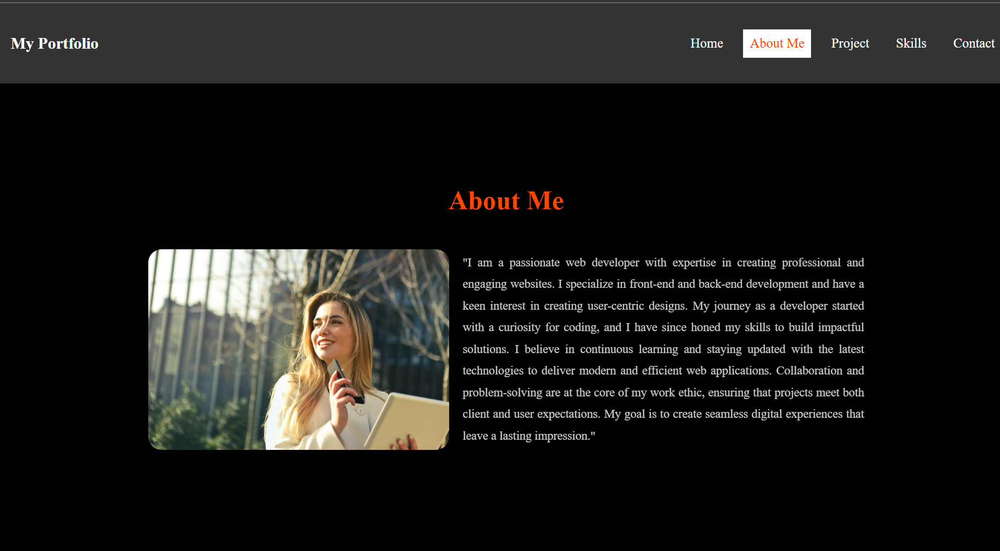

# Fullstack Developer Portfolio Website Project 🌐

## About the Project
This project is a portfolio website template designed to showcase work, skills, and achievements. It can be customized by anyone who wants to create an online presence or share their professional journey.

## Features
- **Landing Page**: An attractive introduction with space for a tagline or personal branding.
- **Projects Section**: Displays work samples with descriptions, images, and optional links to live demos or repositories.
- **Skills Section**: Highlights key skills and technologies.
- **Contact Section**: Includes a functional contact form to allow visitors to get in touch.
- **Responsive Design**: Ensures the website looks great on all devices.

## Technologies Used
- **HTML5**: To structure the content.
- **CSS3**: For layout and styling, including animations and responsiveness.
- **JavaScript**: For interactivity and dynamic content.

## Screenshots:
### I have attached the screenshots below for reference.

